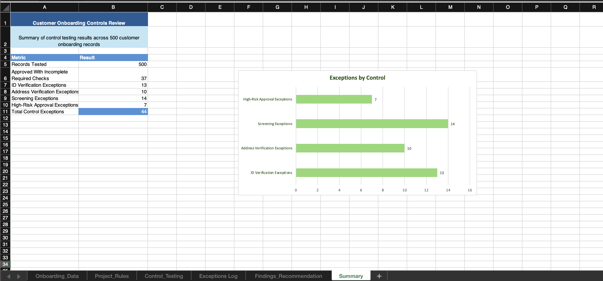

# Customer Onboarding Controls Review

## Project Overview

In this project, I reviewed 500 customer onboarding records to check whether the required checks were completed before customers were approved.

I used Excel to test the data, find customers who did not meet the required checks and record the findings and recommendations.

## What I Checked

I checked whether:

- ID verification was completed before approval
- Address verification was completed before approval
- Screening was completed before approval
- High-risk customers had additional approval
- Customers were approved with incomplete required checks

## What I Found

From the 500 records:

- 13 customers were approved without ID verification
- 10 customers were approved without address verification
- 14 customers were approved before screening was completed
- 7 high-risk customers were approved without additional approval
- 37 approved customers had at least one required onboarding check incomplete

There were 44 exceptions across the four individual checks. This does not mean there were 44 different customers, as one customer could fail more than one check.

## Recommendations

For ID and address verification, I recommended that customers should not be approved until these checks have been completed.

For screening, approval should only happen after screening is complete and any issues found have been reviewed.

For high-risk customers, the additional review and approval should be completed before the customer is fully approved.

## Excel Workbook

The workbook contains:

- The customer onboarding data
- The rules used for the project
- Control testing
- An exceptions log
- Findings and recommendations
- A summary page and chart

## Project Summary

## Tools Used

- Microsoft Excel

## Note

The data and rules used in this project are fictional and were created for portfolio purposes.
